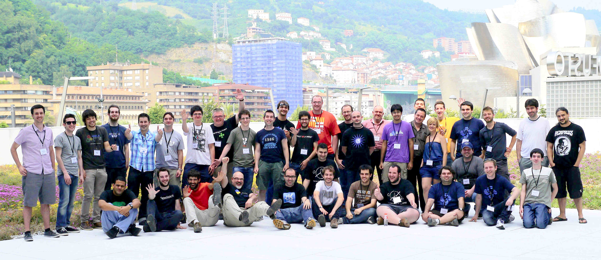

Akademy-es 2013
=============

An interactive article about last Akademy-es in Bilbao, based on [Resonate](https://github.com/jplusplus/resonate2014).

## Credits
Text, editing, and most of the photos by [Martín González](https://twitter.com/mgonzalezgmz) | CC-BY-SA.
- Group photo by [Knut Yrvin](http://kde-espana.org/akademy-es2013/fotogrupo.html).
- Guggenheim photo: CC-BY-NC-SA, [Dominik Morbitzer](https://www.flickr.com/photos/dominikmorbitzer/7886187940).
- Footer image: CC-BY-SA, [Subtle Patterns](http://subtlepatterns.com/).

License : GNU General Public License V3

### Resonate credits:
By [Anne-Lise Bouyer](https://twitter.com/annelisebouyer), [Sebastian Kraus](https://twitter.com/sm_kraus) et [Edouard Richard](https://twitter.com/vied12) for [Journalism++](http://jplusplus.org/)  
CC-BY-SA Journalism++ SAS ⁞ Photos © Resonate.

License : GNU General Public License V3